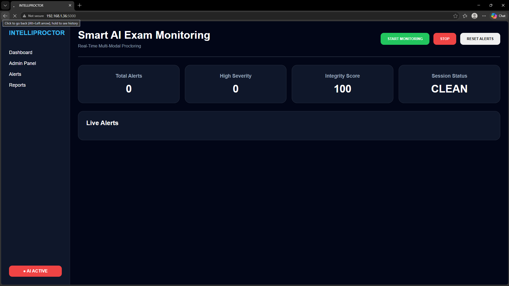
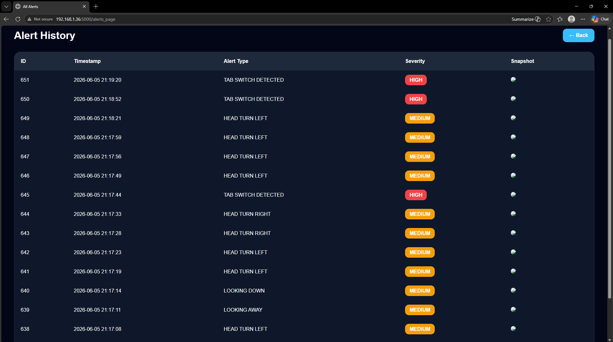
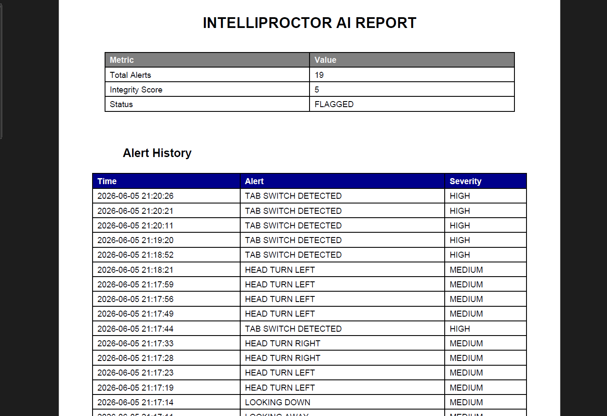

# IntelliProctor – AI Powered Online Examination Monitoring System

## Overview

IntelliProctor is an AI-powered online examination monitoring system designed to ensure exam integrity without requiring human invigilators. The system uses real-time webcam and microphone analysis to monitor student behavior and automatically detect suspicious activities during online examinations.

## Features

* Eye movement and gaze tracking
* Head pose detection
* Multiple person detection using YOLOv8
* Face absence detection
* Suspicious audio detection
* Automatic alert generation with timestamps
* Screenshot evidence capture
* Integrity Score calculation
* Real-time admin monitoring dashboard

## Technologies Used

* Python
* OpenCV
* MediaPipe
* YOLOv8
* Flask
* SQLite
* PyAudio

## Project Architecture

Input (Webcam + Microphone)
↓
AI Detection Modules
↓
Behavior Analysis
↓
Alert Generation
↓
Database Storage
↓
Admin Dashboard & Reports

## Future Improvements

* Cloud deployment
* User authentication
* Face recognition verification
* Advanced AI behavior analysis
  
## Screenshots

### Dashboard

### Alerts

### Working

### Report

## Developed By

Prasanna B
